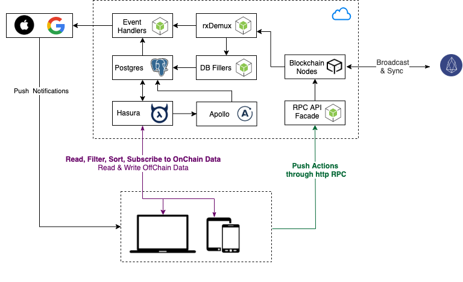

# ChainGraph Community Edition

A realtime GraphQL API and indexing service for blockchain applications.

<!-- START doctoc generated TOC please keep comment here to allow auto update -->
<!-- DON'T EDIT THIS SECTION, INSTEAD RE-RUN doctoc TO UPDATE -->

- [Features](#features)
- [Architecture](#architecture)
- [rxDemux](#rxdemux)
- [Why GraphQL](#why-graphql)
- [ChaingGraph as a Service](#chainggraph-as-a-service)
- [Usage](#usage)
- [Docker-Compose Commands](#docker-compose-commands)
- [Directory Structure](#directory-structure)
- [Contributing](#contributing)
- [Blockmatic](#blockmatic)

<!-- END doctoc generated TOC please keep comment here to allow auto update -->

## Features

- Realtime indexing of smart contracts state and action traces.
- Realtime GraphQL subscriptions to blockchain state.
- Realtime GraphQL subscriptions to blockchain actions.
- Powerful querying, sorting and filtering.
- Blockchain RPC facade with push through guarantees.
- Query data from multiple blockchains and contracts with a single request.
- Microfork handling on the backend, subscribe to state on the clients not to deltas.
- Custom event handlers with TypeScript (useful for sms, push notifications and more).
- Custom postgres tables, automated graphql support and administrative console thru Hasura.
- Custom offchain data resolvers with Apollo.
- Supports ad-hoc external graph stitching and federation.
- Supports ad-hoc offchain graphql resolvers.

## Architecture

<center>
  
</center>

## Demux

Demux is a backend infrastructure pattern for sourcing blockchain events to deterministically update queryable datastores and trigger side effects.

Taking inspiration from the [Flux Architecture](https://facebook.github.io/flux/docs/in-depth-overview.html#content) pattern and [Redux](https://github.com/reduxjs/redux/), Demux was born out of the following qualifications:

1. A separation of concerns between how state exists on the blockchain and how it is queried by the client front-end.
1. Client front-end is not responsible for determining derived, reduced, and/or accumulated state.
1. The ability for blockchain events to trigger new transactions, as well as other side effects outside of the blockchain.
1. The blockchain as the single source of truth for all application state.

ChainGraph leverages this pattern to filter and stream data from the blockchain nodes to the database fillers (indexers) and event handlers.

## Why GraphQL

GraphQL provides a complete and understandable description of the data in your API, gives clients the power to ask for exactly what they need and nothing more and enables powerful developer tools.

There are many reason for choosing GraphQL over other solutions, read [Top 5 Reasons to Use GraphQL](https://www.prisma.io/blog/top-5-reasons-to-use-graphql-b60cfa683511/).

**Move faster with powerful developer tools**

Know exactly what data you can request from your API without leaving your editor, highlight potential issues before sending a query, and take advantage of improved code intelligence. GraphQL makes it easy to build powerful tools like [GraphiQL](https://github.com/graphql/graphiql) by leveraging your API’s type system.

Learn more at https://graphql.org & https://www.howtographql.com

## ChaingGraph as a Service

You can leverage ChainGraph powerful features without worrying about running any infrastructure. Head over chaingraph.io to learn more.

Once you adquire a ChainGraph key you will be able to add any smart contract to ChainGraph and start consuming real-time updates in seconds.

ChainGraph CLI and the Satellite framework allow you quickly get started with high quality scoffolds for mobile, desktop and web clients as well as complementary backend services ( satellites ).

## Usage

Basic knowledge about Docker, Docker Compose, EOSIO and NodeJS is required.

**Global Dependencies**

- Docker https://docs.docker.com/install/.  
  At least 6GB RAM (Docker -> Preferences -> Advanced -> Memory -> 6GB or above)
- Hasura CLI https://docs.hasura.io/1.0/graphql/manual/hasura-cli/install-hasura-cli.html
- EOSIO node with State History plugin.

Setup Docker and Docker Compose in Linux

https://www.educative.io/edpresso/how-to-install-docker-on-ubuntu-1804
https://phoenixnap.com/kb/install-docker-compose-on-ubuntu-20-04

**Optionally**

- Install node.js v11 on your machine. We recommend using [n](https://github.com/tj/n) or [nvm](https://github.com/creationix/nvm), and [avn](https://github.com/wbyoung/avn) to manage multiple node.js versions on your computer.
- Yarn https://yarnpkg.com/lang/en/docs/install/.

## Docker-Compose Commands

- `docker-compose build` build all containers,
- `docker-compose up` starts all containers.
- `docker-compose up --build` rebuilds and starts all containers.
- `docker-compose exec [service_name] [bash | sh]` open bash or sh in a container.
- `docker-compose stop` stops all containers.
- `docker-compose down` stops and removes all containers.
- `docker-compose restart` restarts all services.

## Directory Structure

```
.
├── src ................................................. source code
│   ├── config/ ......................................... chaingraph configuration files
│   ├── events/ ......................................... event handlers, push notif, etcs
│   ├── fillers/ ........................................ database fillers
│   ├── hasura/ ......................................... graphql engine and db migrations
│   ├── reader/ ......................................... blockchain data readers
│   ├── types/ .......................................... typescript types
│   ├── utils/ .......................................... utility functions
│   ├── generated/ ...................................... codegen auto-generated graphql sdk
│   └── workers/ ........................................ nodejs workers
├── docs/ ............................................... documentation
└── logs/ ............................................... logs
```

## Contributing

Read the [contributing guidelines](https://developers.blockmatic.io) for details.

## Blockmatic

Blockmatic is building a robust ecosystem of people and tools for the development of blockchain applications.

[blockmatic.io](https://blockmatic.io)

<!-- Please don't remove this: Grab your social icons from https://github.com/carlsednaoui/gitsocial -->

<!-- display the social media buttons in your README -->

[![Blockmatic Twitter][1.1]][1]
[![Blockmatic Facebook][2.1]][2]
[![Blockmatic Github][3.1]][3]

<!-- links to social media icons -->
<!-- no need to change these -->

<!-- icons with padding -->

[1.1]: http://i.imgur.com/tXSoThF.png 'twitter icon with padding'
[2.1]: http://i.imgur.com/P3YfQoD.png 'facebook icon with padding'
[3.1]: http://i.imgur.com/0o48UoR.png 'github icon with padding'

<!-- icons without padding -->

[1.2]: http://i.imgur.com/wWzX9uB.png 'twitter icon without padding'
[2.2]: http://i.imgur.com/fep1WsG.png 'facebook icon without padding'
[3.2]: http://i.imgur.com/9I6NRUm.png 'github icon without padding'

<!-- links to your social media accounts -->
<!-- update these accordingly -->

[1]: http://www.twitter.com/blockmatic_io
[2]: http://fb.me/blockmatic.io
[3]: http://www.github.com/blockmatic

<!-- Please don't remove this: Grab your social icons from https://github.com/carlsednaoui/gitsocial -->
